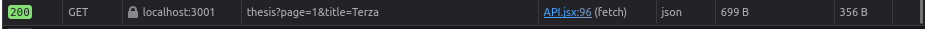
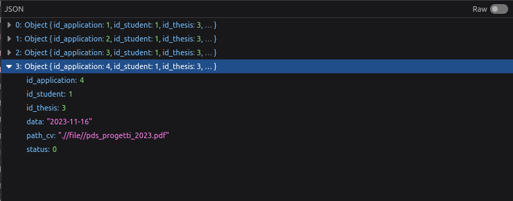

# End to end testing
### Story 1, Insert proposal

###### Front-end

###### Request

###### Response

###### Status code 200

###### Status code 400, co supervisor is missing

### Story 2, Search proposal

###### Front-end

###### Request as query parameters
###### Response

###### Status code 200

###### Status code 200 with title filter

### Story 3, Apply for proposal

###### Front-end

###### Response

###### Status code 200

### Story 4, Browse Applications

###### Front-end

###### Response

### Story 5, Accept Application

###### Front-end

###### Status code 200
