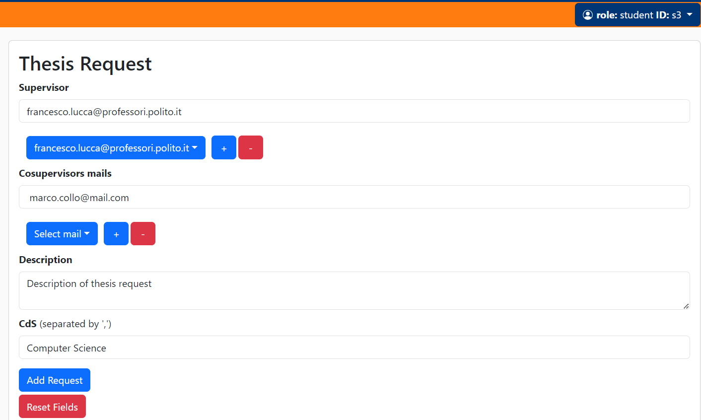

# End to end testing
### Story 1, Insert proposal

###### Front-end

###### Request

###### Response

###### Status code 200

###### Status code 400, co supervisor is missing

### Story 2, Search proposal

###### Front-end

###### Request as query parameters
###### Response

###### Status code 200

###### Status code 200 with title filter

### Story 3, Apply for proposal

###### Front-end

###### Response

###### Status code 200

### Story 4, Browse Applications

###### Front-end

###### Response

### Story 5, Accept Application

###### Front-end

###### Status code 200

### Story 6, Browse Application Decisions

###### Front-end

###### Response

###### Status code 200

### Story 7, Browse Proposals

###### Front-end

###### Response

###### Status code 200

### Story 8, Update Proposal

###### Front-end

###### Response

### Story 9, Notify Application Decision

###### Front-end

### Story 10, Delete Proposal

###### Front-end

###### Response

### Story 11, Copy Proposal

###### Front-end

###### Response

### Story 12, Archive Proposal

###### Front-end

###### Response

### Story 13, Access Applicant CV

###### Front-end

###### Response

### Story 14, Notify Application

###### Front-end

### Story 15, Proposal Expiration

###### Front-end

### Story 16, Search Archive

###### Front-end

###### Response

### Story 29, Insert Student Request

###### Front-end

###### Response

### Story 30, Secretary Approve Student Requests

###### Front-end

###### Response

### Story 31, Professor Approve Student Requests

###### Front-end

###### Response

### Story 32, Notify Professor Thesis Request

###### Front-end

